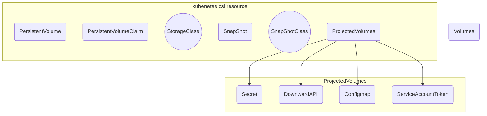

# Volumes

## Persistent volumes
- Volume type
  - Static
  - Dynamic
- Lifecycle
  - Binding
  - Using
  - Relaiming
  - Retain
  - Delete
  - Recycle
## Projected volumes
- Secret
- Downwardapi
- Configmap
- ServiceAccountToken

## Ephemeral volumes

- Tempdir
- Configmap
- Downwardapi

